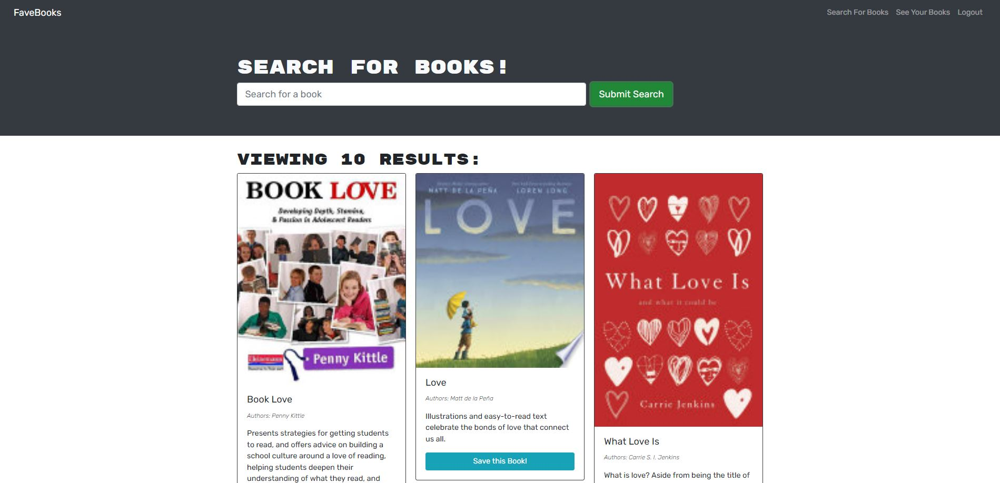
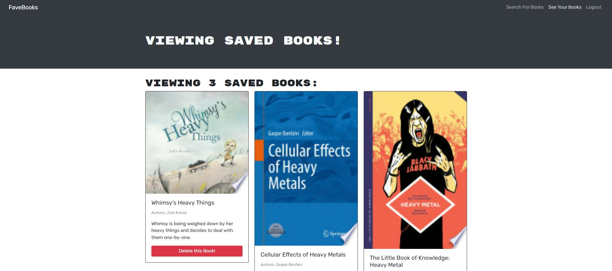

# FaveBooks

## Description
A bookworm's delight!  FaveBooks is a JavaScript-based application that visitors users to search for book recommendations based on keyword(s).  Visitors can also sign up as users to save and delete their favorite titles.

## **Table of Contents**
* [Screenshots](#screenshots)
* [Programs](#programs)
* [Website](#website)
* [Usage](#usage)
* [License](#license)
* [Questions](#questions)

## **Screenshots**

## **Programs**
* Apollo
* Apollo Server Express
* bcrypt
* Bootstrap
* Concurrently
* CSS
* Express
* Google API
* GraphQL
* Heroku
* HTML
* JavaScript
* JSON Web Token
* JWT Decode
* MongoDB
* Mongoose
* Node
* nodemon
* React
* React Router

## **Website**
<a href="https://fave-books.herokuapp.com/" target="_blank">FaveBooks</a>

## **Usage**
***Note: Using Chrome is highly recommended for the optimal experience***
1. Visit the site using Chrome on your computer or smart phone
2. Use the search bar to find book recommendations based on keyword
3. Sign up and log in as a user to save books as favorites
4. Once logged in, click the 'See Your Books' link to view your saved books
5. Encourage your friends to sign up!

## **License**
The project is distributed under the [Creative Commons License](https://creativecommons.org/publicdomain/zero/1.0/)

## **Questions**
Please contact me directly with any additional questions:
* [GitHub](https://github.com/ChristopherLawn)
* [Email](mailto:christopher.d.lawn@gmail.com)